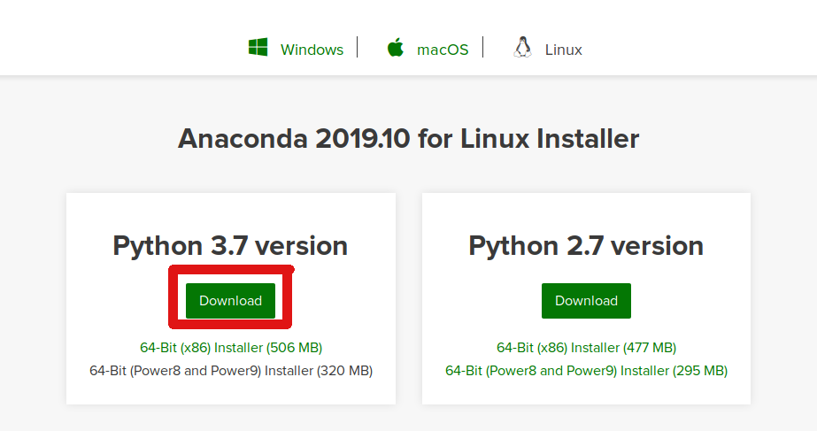

[Back to main installation page](README.md)

## Installation instruction - Windows

These steps have been tested on an up-to-date version of Windows 10 (last updated Nov. 4 2019).

On the [anaconda website](https://www.anaconda.com/distribution/), download the python 3.7 version of the anaconda installer for windows. __Make sure to select the right file for your system (32-bit or 64-bit)__

Click here for a picture

### __NOTE: WINDOWS INSTRUCTIONS ARE UNLIKELY TO WORK ON OLDER VERSIONS OF WINDOWS. IF YOU DON'T HAVE WINDOWS 10, WE RECOMMEND YOU DO YOUR WORK ON ERDA INSTEAD OF YOUR OLDE LAPTOP__

